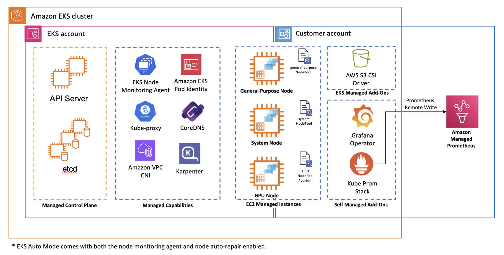

# GenAI on EKS Workshop

> Deploy the full [GenAI on EKS Workshop](https://genai.eksworkshop.com/) infrastructure to your own AWS account using Terraform. This lets you follow along with the workshop using your own environment, and copy-paste commands directly from the workshop into your IDE or terminal.

## Architecture



The workshop deploys:

- **EKS Auto Mode** cluster (`genai-workshop`)
- **Amazon Managed Prometheus (AMP)** for metrics collection
- **Grafana** with pre-built dashboards for vLLM, Ray Serve, and DCGM
- **S3 bucket** (`genai-models-<account-id>`) for model storage via Mountpoint S3 CSI driver
- **Mistral-7B-Instruct-v0.3** downloaded from HuggingFace and stored in S3
- **kube-prometheus-stack** for cluster observability

---

## Prerequisites

Make sure you have the following installed before starting:

| Tool | Version | Install |
| ---- | ------- | ------- |
| AWS CLI | >= 2.32.8 | [Guide](https://docs.aws.amazon.com/cli/latest/userguide/getting-started-install.html) |
| Terraform | >= 1.3.2 | [Guide](https://developer.hashicorp.com/terraform/install) |
| kubectl | latest | [Guide](https://kubernetes.io/docs/tasks/tools/) |
| Docker | latest | [Guide](https://docs.docker.com/get-docker/) |

---

## Deploy to Your Account

This setup copies the base infrastructure and workshop-specific Terraform configs into a `_LOCAL` working directory, then deploys everything.

### 1. Clone the repo

```bash
git clone https://github.com/awslabs/ai-on-eks.git
cd ai-on-eks/infra/workshops/genai-on-eks
```

### 2. Configure your deployment

Edit `terraform/blueprint.tfvars` and update the `region` to your preferred AWS region:

```hcl
name                            = "genai-workshop"
region                          = "us-east-2"   # update this to your region
enable_eks_auto_mode            = true
enable_kube_prometheus_stack    = true
enable_grafana_operator         = true
grafana_service_port            = 3000
grafana_admin_password          = "notforproductionuse"
kube_prometheus_stack_namespace = "monitoring"
enable_amazon_prometheus        = true
enable_s3_models_storage        = true
```

### 3. Run the install script

```bash
chmod +x install.sh
./install.sh
```

This will:

1. Copy base Terraform modules into `terraform/_LOCAL/`
2. Add workshop-specific configs on top of the base
3. Run `terraform init` and `terraform apply`

> Deployment takes ~20-25 minutes. The Mistral-7B model download job runs inside the cluster after provisioning.

### 4. Configure kubectl

```bash
aws eks update-kubeconfig --name genai-workshop --region <your-region>
```

## Follow the Workshop

Once your infrastructure is deployed, follow the [self-paced setup guide](https://catalog.workshops.aws/genai-on-eks/en-US/50-getting-started/01-self-paced) to get started.

As part of setup, you need to create an On-Demand Capacity Reservation (ODCR). Follow the [ODCR instructions here](https://catalog.workshops.aws/genai-on-eks/en-US/50-getting-started/01-self-paced#create-on-demand-capacity-reservation-(odcr)).

Once you have your ODCR, continue from the [introduction section](https://catalog.workshops.aws/genai-on-eks/en-US/100-introduction) and copy-paste commands directly into your terminal or IDE.

> [!NOTE]
> Since you deployed the infrastructure using your own AWS account and Terraform, you already have access to your own terminal and AWS credentials. Skip the "Access the IDE" and "Access AWS Console" steps in the self-paced guide — those are only needed for AWS-hosted event participants who use a pre-provisioned environment. Continue directly from the introduction section onwards.

---

## Cleanup

To destroy all resources and avoid ongoing AWS charges:

```bash
cd terraform/_LOCAL
./cleanup.sh
```

This runs `terraform destroy` and removes all provisioned resources including the EKS cluster, S3 bucket, AMP workspace, and IAM roles.

> The S3 bucket has `force_destroy = true` so it will be deleted even if it contains model files.

> **Known Issue:** If `enable_kube_prometheus_stack = true`, `terraform destroy` may get stuck and fail with: `client rate limiter Wait returned an error: context deadline exceeded`. Track progress and workarounds in [issue #251](https://github.com/awslabs/ai-on-eks/issues/251).
