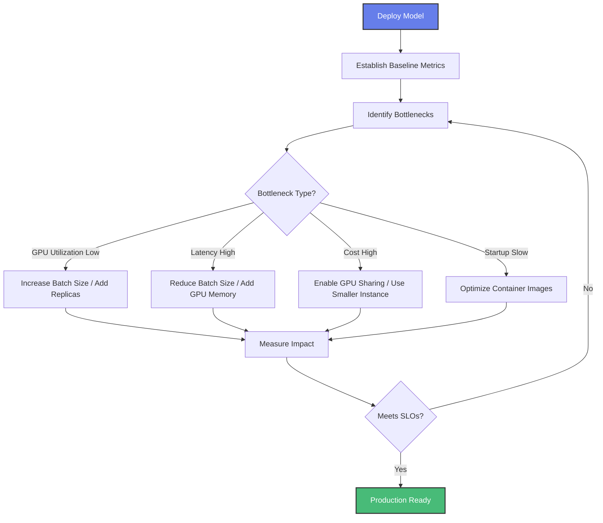

# Model Inference Lifecycle on Amazon EKS

This guide walks you through the complete lifecycle of deploying and optimizing Large Language Model (LLM) inference on Amazon EKS, from infrastructure setup to production-ready optimization.

## Lifecycle Overview

The model inference lifecycle consists of three key phases:


Each phase addresses specific challenges and provides the building blocks needed for successful LLM inference at scale.

---

## [Phase 1: Infrastructure Setup](/docs/infra/inference/inference-ready-cluster)

### Why Infrastructure Matters

Before deploying any LLM, you need a robust, scalable infrastructure that can handle the unique demands of AI/ML workloads:

- **GPU/Neuron Resource Management**: LLMs require specialized accelerators (NVIDIA GPUs or AWS Inferentia/Trainium chips) with proper device plugins and drivers
- **Autoscaling Capabilities**: Dynamic workload scaling to handle varying inference demand while optimizing costs
- **Observability Foundation**: Monitoring and metrics collection for GPU/Neuron utilization, model performance, and system health
- **Distributed Computing Support**: Infrastructure for multi-node inference when models exceed single-node capacity

### Solution: Inference-Ready Cluster

The [**Inference-Ready EKS Cluster**](/docs/infra/inference/inference-ready-cluster) provides a pre-configured infrastructure specifically designed for AI/ML inference workloads.

#### What You Get

- **Pre-installed Components**:
  - KubeRay Operator for distributed Ray workloads
  - LeaderWorkerSet for multi-node distributed inference
  - NVIDIA Device Plugin for GPU management
  - AWS Neuron Device Plugin for Inferentia/Trainium support
  - Karpenter for intelligent node autoscaling

- **Built-in Observability**:
  - Prometheus for metrics collection
  - Grafana with AI/ML-specific dashboards
  - DCGM Exporter for GPU metrics
  - Node Exporter for system-level metrics

- **AIBrix Integration**:
  - Advanced inference optimization capabilities
  - Gateway and routing for traffic management
  - Performance monitoring tools

#### Key Considerations

When setting up your infrastructure, consider:

1. **Hardware Selection**: Choose between NVIDIA GPUs (P4d, P5, G5) or AWS Neuron (Inf2, Trn1) based on your model requirements and cost constraints
2. **Scaling Strategy**: Determine if you need single-node or multi-node inference based on model size
3. **Network Configuration**: Ensure proper VPC setup with sufficient bandwidth for model loading and inference traffic
4. **Storage Requirements**: Plan for model artifact storage (S3, EFS, or FSx) based on model size and access patterns

#### Get Started

Follow the [Inference-Ready Cluster deployment guide](/docs/infra/inference/inference-ready-cluster) to provision your infrastructure.

---

## [Phase 2: Model Deployment](../../blueprints/inference/inference-charts.md)

### Why Deployment Patterns Matter

Once your infrastructure is ready, deploying LLMs requires careful consideration of:

- **Framework Selection**: Different frameworks (vLLM, Ray-vLLM, Triton) offer different trade-offs in performance, features, and complexity
- **Model Compatibility**: Not all models work with all frameworks; some require specific optimizations
- **Resource Allocation**: Proper GPU/Neuron memory allocation and request/limit configuration
- **Scaling Behavior**: Single-replica vs. multi-replica deployments with autoscaling

### Solution: Inference Charts

The [**AI on EKS Inference Charts**](../../blueprints/inference/inference-charts.md) provide Helm-based deployments with pre-configured values for popular models, supporting multiple deployment frameworks.

#### Supported Frameworks

- **vLLM**: Fast single-node inference with optimized CUDA kernels
- **Ray-vLLM**: Distributed inference with autoscaling and load balancing
- **Triton-vLLM**: Production-ready inference server with advanced features
- **LeaderWorkerSet-vLLM**: Multi-node inference for models that don't fit on a single node
- **Diffusers**: Hugging Face Diffusers for image generation models

#### Example: Deploying Llama 3.2 1B

Let's walk through deploying a Llama model using the inference charts:

**Step 1: Create Hugging Face Token Secret**

```bash
kubectl create secret generic hf-token \
  --from-literal=token=your_huggingface_token
```

**Step 2: Deploy the Model**

```bash
# Deploy Llama 3.2 1B on GPU with vLLM
helm install llama-inference ./blueprints/inference/inference-charts \
  --values ./blueprints/inference/inference-charts/values-llama-32-1b-vllm.yaml
```

**Step 3: Verify Deployment**

```bash
# Check pod status
kubectl get pods -l app=llama-inference

# Check service endpoint
kubectl get svc llama-inference
```

**Step 4: Test Inference**

```bash
# Port forward to the service
kubectl port-forward svc/llama-inference 8000:8000

# Send a test request
curl http://localhost:8000/v1/completions \
  -H "Content-Type: application/json" \
  -d '{
    "model": "meta-llama/Llama-3.2-1B",
    "prompt": "Explain quantum computing in simple terms:",
    "max_tokens": 100
  }'
```

#### Available Pre-configured Models

The inference charts include ready-to-deploy configurations for:

**Language Models**:
- DeepSeek R1 Distill Llama 8B
- Llama 3.2 1B, Llama 4 Scout 17B
- Mistral Small 24B
- GPT OSS 20B
- Qwen3 1.7B

**Diffusion Models**:
- FLUX.1 Schnell
- Stable Diffusion XL, Stable Diffusion 3.5
- Kolors, OmniGen

**Neuron-Optimized**:
- Llama 2 13B on AWS Inferentia

#### Key Considerations

When deploying your model, consider:

1. **Model Size vs. Hardware**: Ensure your chosen instance type has sufficient GPU/Neuron memory for the model
2. **Batch Size Configuration**: Tune batch size for optimal throughput vs. latency trade-offs
3. **Quantization Options**: Consider using quantized models (INT8, INT4) to reduce memory footprint
4. **Replica Count**: Start with a single replica and scale based on observed load
5. **Health Checks**: Configure appropriate liveness and readiness probes

#### Get Started

Explore the [Inference Charts documentation](../../blueprints/inference/inference-charts.md) for detailed configuration options and advanced deployment scenarios.

---

## [Phase 3: Optimization](/docs/guidance/)

### Why Optimization Matters

After deploying your model, optimization ensures:

- **Cost Efficiency**: Minimize infrastructure costs while meeting performance requirements
- **Performance Tuning**: Achieve target latency and throughput SLOs
- **Resource Utilization**: Maximize GPU/Neuron utilization to get the most value from expensive hardware
- **Operational Excellence**: Implement best practices for monitoring, alerting, and troubleshooting

### Optimization Techniques

The [**Guidance section**](/docs/guidance/index.md) provides comprehensive best practices and optimization techniques for production AI/ML workloads. Each technique addresses specific performance or cost challenges:

#### [Container Startup Time Optimization](/docs/guidance/container-startup-time/)

Reduce model loading time from minutes to seconds, improving autoscaling responsiveness and development iteration speed.

**Key Techniques**:
- **[Reduce Image Size](/docs/guidance/container-startup-time/reduce-container-image-size/)**: Optimize container images to minimize pull time
- **[Decouple Model Artifacts](/docs/guidance/container-startup-time/reduce-container-image-size/decoupling-model-artifacts)**: Separate model weights from container images
- **[Accelerate Pull Process](/docs/guidance/container-startup-time/accelerate-pull-process/)**: Use containerd snapshotters and image pre-fetching
- **[Pre-fetch on Nodes](/docs/guidance/container-startup-time/accelerate-pull-process/prefecthing-images-on-br)**: Warm up nodes with model images before workload scheduling

**Impact**: Reduces startup time by 60-80%, enabling faster autoscaling and lower costs.

**When to Use**: Critical for autoscaling workloads, development environments, and cost-sensitive deployments.

---

#### [Dynamic Resource Allocation (DRA)](/docs/guidance/dynamic-resource-allocation)

Next-generation GPU scheduling for fine-grained resource control and improved utilization.

**Key Capabilities**:
- **Fine-grained GPU Control**: Request specific GPU memory amounts instead of whole devices
- **Per-workload Sharing**: Choose MPS, time-slicing, MIG, or exclusive mode per pod
- **Topology-aware Scheduling**: Optimize for NVLink and GPU interconnects
- **Required for P6e**: Mandatory for Amazon EC2 P6e-GB200 UltraServers

**Impact**: Increases GPU utilization from 30-40% to 70-90%, reducing infrastructure costs by 50%+.

**When to Use**:
- Running multiple small models on a single GPU
- Need precise GPU memory allocation
- Using latest GPU instances (P6e)
- Optimizing GPU utilization across workloads

---

#### [Observability and Monitoring](/docs/guidance/observability)

Comprehensive visibility into inference workloads for performance optimization and troubleshooting.

**What's Included**:
- **GPU/Neuron Metrics**: Track utilization, memory usage, and temperature
- **Model Performance**: Monitor latency, throughput, and error rates
- **System Health**: CPU, memory, network, and storage metrics
- **Custom Dashboards**: Pre-built Grafana dashboards for inference workloads

**Key Metrics to Monitor**:
- GPU utilization (target: >70% for cost efficiency)
- Inference latency (P50, P95, P99)
- Requests per second (throughput)
- Queue depth (for autoscaling decisions)
- Model loading time

**Impact**: Enables data-driven optimization decisions and proactive issue detection.

---

#### [Networking Optimization](/docs/guidance/networking)

Optimize network configuration for high-throughput inference workloads.

**Key Areas**:
- **VPC Design**: Proper subnet sizing and availability zone distribution
- **Load Balancing**: ALB/NLB configuration for inference endpoints
- **Service Mesh**: Istio/Linkerd for advanced traffic management
- **Network Policies**: Security and isolation between workloads

**Impact**: Reduces network latency by 20-40% and improves reliability.

---

#### [EKS Best Practices](/docs/guidance/eks-best-practices)

Comprehensive guides for security, reliability, performance, and cost optimization.

**Topics Covered**:
- Security and compliance
- Reliability and availability
- Performance optimization
- Cost optimization

---

### Optimization Workflow

Follow this workflow to optimize your inference deployment:



#### Get Started

Explore the [Guidance documentation](/docs/guidance/index.md) to dive deep into each optimization technique.

---

## Complete Lifecycle Example

Here's a complete example of deploying Llama 3.2 1B from infrastructure to optimized production:

### Step 1: Deploy Infrastructure (30-45 minutes)

```bash
# Clone the repository
git clone https://github.com/awslabs/ai-on-eks.git
cd ai-on-eks/infra/solutions/inference-ready-cluster

# Configure your deployment
cp blueprint.tfvars.example blueprint.tfvars
# Edit blueprint.tfvars with your settings

# Deploy the infrastructure
terraform init
terraform apply -var-file=blueprint.tfvars
```

### Step 2: Deploy Model (5-10 minutes)

```bash
# Update kubeconfig
aws eks update-kubeconfig --name <cluster-name> --region <region>

# Create Hugging Face token secret
kubectl create secret generic hf-token \
  --from-literal=token=<your-token>

# Deploy Llama 3.2 1B
helm repo add ai-on-eks https://awslabs.github.io/ai-on-eks-charts/
helm repo update

helm install qwen3-1-7b ai-on-eks/inference-charts \
  -f https://raw.githubusercontent.com/awslabs/ai-on-eks-charts/refs/heads/main/charts/inference-charts/values-llama-32-1b-vllm.yaml
```

### Step 3: Optimize (Ongoing)

```bash
# Access Grafana for monitoring
kubectl port-forward -n monitoring svc/kube-prometheus-stack-grafana 3000:80

# Monitor GPU utilization and adjust replicas
kubectl scale deployment llama-inference --replicas=3

# Enable autoscaling based on queue depth
kubectl autoscale deployment llama-inference \
  --min=2 --max=10 --cpu-percent=70
```

---

## Next Steps

Now that you understand the complete model inference lifecycle, choose your starting point:

- **New to EKS?** Start with [Infrastructure Setup](/docs/infra/inference/inference-ready-cluster)
- **Have Infrastructure?** Jump to [Model Deployment](../../blueprints/inference/inference-charts.md)
- **Model Running?** Optimize with [Guidance](/docs/guidance/index.md)

## Additional Resources

- [AI on EKS GitHub Repository](https://github.com/awslabs/ai-on-eks)
- [AWS EKS Documentation](https://docs.aws.amazon.com/eks/)
- [NVIDIA GPU Operator](https://docs.nvidia.com/datacenter/cloud-native/gpu-operator/)
- [AWS Neuron Documentation](https://awsdocs-neuron.readthedocs-hosted.com/)
- [vLLM Documentation](https://docs.vllm.ai/)
- [Ray Documentation](https://docs.ray.io/)

## Community and Support

- [GitHub Issues](https://github.com/awslabs/ai-on-eks/issues) - Report bugs or request features
- [GitHub Discussions](https://github.com/awslabs/ai-on-eks/discussions) - Ask questions and share experiences
- [AWS re:Post](https://repost.aws/) - Get help from AWS experts and community
